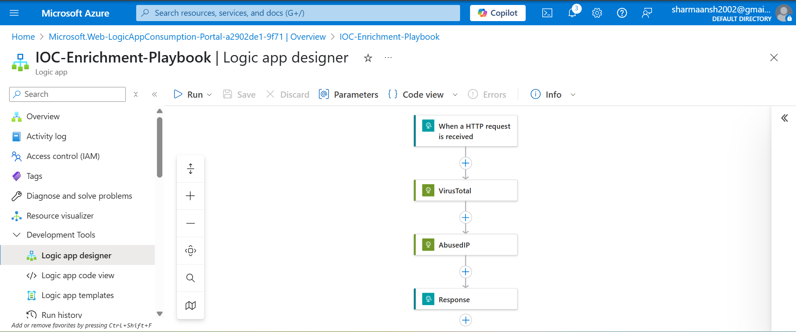

# cloud-soar-playbooks
# 🔐 IOC Enrichment Playbook (Azure Logic App)

This Logic App enriches IP address IOCs using VirusTotal and AbuseIPDB APIs. Designed for quick IOC triage in a cloud SOAR environment.

## 🚀 How It Works

1. Triggered via HTTP POST (manual or from SIEM)
2. Pulls enrichment data:
   - 🔍 VirusTotal IP scan
   - 🛡️ AbuseIPDB reputation check
3. Returns JSON response for analyst or automated action

## 🛠 Tech Stack

- Microsoft Azure Logic Apps (Consumption – Multi-tenant)
- VirusTotal API v3
- AbuseIPDB API v2
- HTTP Triggers & Actions

## 🔁 Sample Request

```json
{
  "ip": "8.8.8.8"
}

## 📸 Screenshots

| Logic App Designer | Postman Test |
|--------------------|--------------|
|  | .png) |

## 📄 Full Sample Output

[Click here to view full response](Postman-success-Response full output.json)


